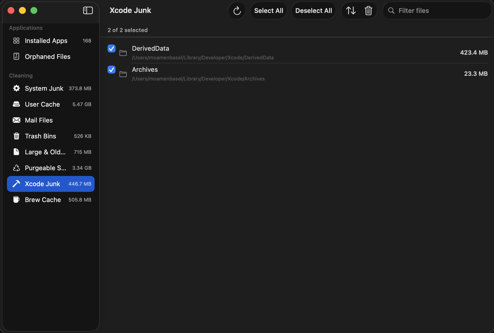

<p align="center">
  
</p>

<p align="center">
  
</p>

## 🌐 [点击这里：切换到中文版本 (Chinese Version)](docs/README.zh-Hans.md)
---

<p align="center">
  
</p>

<h1 align="center">AppSift</h1>

<p align="center">
  <b>Reclaim your soldered SSD. A 100% offline, zero-telemetry, AGPL-3.0 open-source macOS cleaner & uninstaller that kills predatory subscriptions.</b>
</p>

<p align="center">
  <a href="https://github.com/GravityPoet/AppSift/releases/latest"></a>
  
  
  
  <a href="LICENSE"></a>
  <a href="https://github.com/GravityPoet/AppSift/stargazers"></a>
  <a href="https://github.com/GravityPoet/AppSift/releases"></a>
</p>

<p align="center">
  <a href="#-quick-start">Quick Start</a> -
  <a href="#️-licensing--commercial-terms">Licensing</a> -
  <a href="#-the-why">The Why</a> -
  <a href="#-before-vs-after">Before vs. After</a> -
  <a href="#-key-features">Features</a> -
  <a href="#-who-needs-this">Who Needs This</a> -
  <a href="#-how-it-compares">How it Compares</a> -
  <a href="#-our-promise">Our Promise</a> -
  <a href="#-permissions">Permissions</a>
</p>

---

## ⚡ Quick Start

Start clearing space in less than 60 seconds:

```bash
# 1. Tap the repository
brew tap GravityPoet/tap

# 2. Install AppSift
brew install --cask appsift
```

Or download the latest `.dmg` from [Releases](https://github.com/GravityPoet/AppSift/releases/latest) and drag AppSift into `/Applications`.

For developers who want to inspect and compile locally, check out the [Advanced Source Build Guide](#-advanced-source-build-guide).

---

## ⚖️ Licensing & Commercial Terms

- **Community Edition (AGPL-3.0)**: **100% Free** for personal and individual use. Full-featured app uninstaller, system cleaner, orphan finder, and developer cache purger with zero telemetry.
- **Commercial & Enterprise Use**: For commercial deployment, closed-source integration, or business usage, explicit authorization and a Commercial License from GravityPoet is required.

---

## 🎯 The Why

Why does the world need another Mac cleaner? Because Apple sells base-model Macs with **soldered, non-upgradable SSDs** at astronomical prices, while commercial cleaning utilities charge predatory annual subscriptions, leak your app usage metadata, and trade on fake urgency and FUD (Fear, Uncertainty, and Doubt) like *"47 GB of critical junk detected!"* to scare you into buying.

AppSift is the antidote. It is **100% free**, **MIT-licensed**, completely **offline-first**, and brutally honest about what can actually be purged. It recovers gigabytes of lost space by targeting actual system and developer clutter, without gimmicks.

---

## ⚖️ Before vs. After

| Before AppSift (The Pain) ❌ | After AppSift (The Joy) 🎉 |
|---|---|
| Paying $40+/year for disk utilities just to click "Clean". | **100% Free (MIT)**. Keep your hard-earned budget. |
| Creepy trackers & telemetry profiling your app usage history. | **Zero Telemetry**. Bounded, offline-first. It doesn't even know you exist. |
| Leftovers from deleted apps (plists, containers, launchdaemons) silently rotting in `~/Library`. | **Deep Orphan Scan**. Matches bundles to trace and sweep every hidden byte. |
| Dev caches (Xcode, Node, Docker, Ollama) eating 50GB without you knowing. | **Developer-First Purger**. Safely wipes giant compiler, package, and LLM caches in one click. |
| Dramatized red counters crying "Your Mac is in danger!" | **Honest Statistics**. Real paths, transparent rules, absolute control. |

---

## 🚀 Key Features

- **⚡ Smart Uninstaller & Deep Orphan Finder**
  Dragging apps to the Trash leaves up to 70% of their data behind. AppSift maps application bundle identifiers and containers to trace every plist, launch agent, and log, deleting them safely via Finder-semantic recycle or letting you restore them instantly.

- **⚙️ Developer-First Cache Purger**
  Modern development stacks are storage vampires. AppSift scans and safely flushes giant cache folders from Xcode (`DerivedData`, simulators), Node (`npm`, `yarn`, `pnpm`), Docker (dangling images/containers), and local AI tools like Ollama and LM Studio.

- **🛡️ Bounded, Offline-First & Finder-Safe**
  Zero analytics, zero network tracking. Destructive actions use macOS Finder-semantic recycle (`NSWorkspace.recycle`) to move files to Trash instead of permanent deletion, preventing accidental data loss. Safe paths are hardcoded to protect your system.

---

## 👥 Who Needs This

- 💻 **Mac Mini / Base Macbook Owners:** Married to a 256GB SSD and fighting for every megabyte.
- 🛠️ **Developers & AI Engineers:** Drowning in Xcode DerivedData, npm dependencies, Docker layers, and heavy LLM model caches.
- 🔒 **Privacy Enthusiasts:** Who refuse to grant Full Disk Access to proprietary software with closed-source telemetry.

---

## 📊 How it compares

| | **AppSift** | CleanMyMac | Pearcleaner | Mole | OnyX |
|---|:---:|:---:|:---:|:---:|:---:|
| **Price** | **Free** | $40+/yr | Free | CLI free / GUI paid | Free |
| **Open Source** | **Yes (MIT)** | No | Source-available¹ | CLI only | No |
| **No Telemetry** | **Yes** | No | Yes | Yes | Yes |
| **No Subscription** | **Yes** | No | Yes | — | Yes |
| **Native Mac GUI** | **Yes** | Yes | Yes | Terminal-first | Yes |
| **Release Provenance** | **Source + checksums** | Vendor release | Project release | Source | Project release |
| **App Uninstaller** | **Yes** | Yes | Yes | Partial | No |
| **Trash-first Removal** | **Yes** | Partial | Yes | Partial | No |
| **Honest Purgeable** | **Yes** | No | n/a | n/a | n/a |

<sub>¹ Pearcleaner is Apache 2.0 **+ Commons Clause** - source-available but not OSI-approved (you may not sell it). AppSift is true MIT. Comparison reflects publicly documented features as of 2026; corrections welcome via PR.</sub>

---

## 🤝 Our Promise

A Mac cleaner asks for the deepest permission macOS grants—**Full Disk Access**—and then deletes your files. That demands a level of trust the category has spent twenty years burning. Here is the contract AppSift holds itself to:

*   **Recoverable by default, explicit when it is not.** App uninstall, App Reset, and Installation Files use Finder-semantic `NSWorkspace.recycle`, record every original-to-Trash mapping, and restore eligible items whenever destination permissions allow. Restore never overwrites an existing file; administrator-owned destinations are surfaced for Finder recovery instead of invoking a high-privilege shell. App actions never fall back to permanent deletion. Orphan cleanup also moves files to Trash. Reviewed system-cleaner items such as regenerable caches and logs are permanently deleted only through the separately confirmed cleaner flow.
*   **No telemetry, ever.** No analytics, no crash reporting, no "anonymous usage stats," no network calls to us. The app doesn't know you exist.
*   **Network use is explicit.** AppSift never contacts an AppSift account, analytics, or knowledge-base service. App Updates makes bounded requests only after you click Check for Updates: Apple Lookup for verified App Store receipts, local Homebrew commands for verified Casks, public HTTPS Sparkle appcasts, and electron-updater endpoints read from signed app bundles. GitHub checks use only the exact public owner/repository declared by that bundle; AppSift never guesses a repository or downloads its release assets.
*   **No fake urgency.** No dramatized "47 GB of junk detected!" badge, no red alarm counters, no "your Mac is at risk." We show you neutral facts and let you decide.
*   **No overpromising.** We don't claim to "reclaim purgeable space," "boost RAM," or "speed up your Mac" - things no app can reliably do. See the purgeable-space note below.
*   **You review before anything is removed.** Nothing is auto-deleted. Every item shows its real path with Reveal-in-Finder, and high-risk system paths are hard-excluded in code.
*   **Auditable.** Every app-file candidate shows the evidence that matched it. Each report records whether the action was an uninstall, App Reset, or related-file removal; it also records moved, already-missing, failed, protected, and restored items, and can be exported locally as JSON with a reproducible SHA-256 integrity checksum (explicitly not a digital signature). Reports contain paths, never file contents, are never uploaded, and can be cleared at any time. The exact decision code remains open in [`AppSift/Services`](AppSift/Services) and [`AppSift/Logic/Scanning`](AppSift/Logic/Scanning).

If AppSift ever adds telemetry, a paywall on core features, or a fear-based scan, it will have become the thing it was built to replace. Hold us to this.

---

## 🛠️ Advanced Source Build Guide

If you want to build AppSift from source manually:

```bash
brew install xcodegen
git clone https://github.com/GravityPoet/AppSift.git
cd AppSift
xcodegen generate
./script/build_and_run.sh
```

The runner creates a project-specific `AppSift Local Code Signing` identity in
your login keychain when needed. It is a local self-signed identity, not an
Apple Developer ID, and keeps AppSift's macOS privacy identity stable across
source rebuilds on that Mac. The private key never enters the repository.

The development runner reuses one hidden, Spotlight-excluded DerivedData location and stays attached
while the debug app runs. When you quit it, the runner unregisters and removes
the generated app bundle, so `/Applications/AppSift.app` remains the only
AppSift entry in Spotlight and app launchers. Run
`./script/build_and_run.sh --clean` to remove the reusable build cache too.
The customer release scripts likewise keep only the final DMG/ZIP/status files
and remove their temporary App bundle and build root on every exit.

To build a Universal local release, back up the existing installation, and
atomically replace `/Applications/AppSift.app` with the same stable identity:

```bash
./scripts/install-local.sh
```

The first migration from an ad-hoc build requires one final Full Disk Access
grant. Later local rebuilds retain the same code requirement as long as the
`AppSift Local Code Signing` identity remains in the login keychain.

Customer Release builds currently use that same identity:

```bash
./scripts/release-self-signed.sh
```

The legacy `./scripts/release-local.sh` entry point forwards to this same
self-signed builder, so it cannot silently switch customer builds to another
certificate.

This produces a Universal self-signed DMG and ZIP plus an explicit signing
status file under `build/`. These artifacts are **not Apple-notarized**, so a
customer may need to use Finder's **Open** context-menu action on first launch.
The Developer ID GitHub workflow is manual-only and reserved for a future,
explicit certificate migration; running it would change the macOS privacy
identity and require one migration-time permission grant.

---

## ⚙️ Detailed Feature Breakdown

### App Uninstaller
Discovers apps in `/Applications` and `~/Applications`, then scans a bounded set of relevant Library roots using exact app names, structured bundle identities, container metadata, and identifiers from verified developer entitlements. Three sensitivity tiers - Strict, Enhanced, Deep - control which of those evidence sources may be used, and every displayed candidate explains which rule matched it. A second ownership boundary protects other apps, shared app groups, shared identities, and ambiguous matches instead of silently deleting them. Generic backup, archive, snapshot, recovery, and restore hosts maintained by other tools stay protected when only a display name or partial identifier matches; only a full structured bundle identity, verified app-specific entitlement, container metadata, or explicit app rule can bypass that boundary. A Team ID alone never authorizes removal because one publisher may ship multiple apps. AppSift also builds a read-only App Group relationship map: two apps are linked only when both have valid developer signatures, the same Team ID, and the exact same signed group identifier. The detail sheet names every declaring app, inspects the expected container and Application Scripts paths without following symlinks, and explicitly distinguishes declared access from evidence of recent use. The same graph is available through `AppSift app-relationships` and `AppSift app-relationships --json`. Before removal, AppSift also verifies installation provenance: Mac App Store requires both an App Store certificate and a bounded local receipt; Homebrew Cask requires an exact receipt artifact plus a Caskroom link or matching signed bundle; and a bundled uninstaller is offered only when its valid Team ID matches the selected app. For apps installed by a macOS Installer package, AppSift queries the system receipt database through read-only `pkgutil` commands and requires the receipt payload to cover the selected App. Generic parent folders are collapsed into real external component roots, and the detail view shows each present component's path, payload count, receipt-only/shared/unverified ownership, other receipt IDs, and system-sensitive status. Every external component remains protected evidence and is never imported into the removal selection. Homebrew `zap` paths are likewise shown only as a count and are never treated as removal authorization, while an official uninstaller is revalidated immediately before opening. Uninstall and App Reset both use the system Trash and create a complete local report covering moved, missing, failed, protected, and restored items. App Reset first quits the target, keeps its application bundle installed, and accepts only reviewed current-user data below a narrow `~/Library` allow-list; executable packages, shared group containers, launch items, command-line tools, and system-wide components remain untouched. Removal History can restore eligible items, export a path-only JSON report with an integrity checksum, or clear reports without touching Trash. Apple system apps are excluded automatically. You can also right-click any app in Finder and choose **Services → Uninstall with AppSift** or **Reset with AppSift**; reset requests preselect only the narrower reviewed user-data scope.

### Application Usage
Reads Apple's public Spotlight `kMDItemLastUsedDate` metadata locally and adds a sortable **Last Opened** column plus 30, 90, and 180-day unused filters to Installed Apps. AppSift classifies an app as unused only when a real last-opened date crosses the selected threshold. Missing metadata and future/invalid timestamps remain **No reliable record** instead of being misrepresented as “never opened,” and neither state selects an app for removal.

The same read-only evidence is available through `AppSift app-usage [--days 30|90|180]` and `AppSift app-usage --json`. JSON includes the threshold, summary counts, explicit status for every app, and `null` for unavailable last-used evidence. No usage inventory leaves the Mac.

### App Updates
Checks updates only when requested and chooses a source from evidence on the Mac rather than a private vendor database. Mac App Store results require an App Store signature, a bounded receipt, a Spotlight product ID, and an Apple Lookup bundle-ID match. Homebrew results require the same verified Cask receipt and Caskroom artifact used by the uninstaller, then run a token-bounded `brew outdated` query without silently refreshing taps. Sparkle apps require a valid developer signature and a public HTTPS `SUFeedURL`; AppSift parses a size-bounded appcast and filters stable updates for the current macOS and hardware.

Electron apps are supported when a developer-signed bundle contains an exact `Contents/Resources/app-update.yml`. AppSift accepts only public HTTPS `generic` providers or an exact public GitHub owner/repository, rejects credentials, request headers, private providers, custom GitHub hosts, local/private network targets, and ambiguous metadata, and reads both modern `files[]` and legacy `path` + `sha512` `latest-mac.yml` formats. Squirrel.Mac is shown as local framework evidence, not treated as update authorization. Staged releases and releases requiring a newer Darwin version are reported for review rather than claimed as available to every Mac. GitHub release identity, tag, metadata asset, ZIP name, and release page must all remain within the declared repository.

Before any action, AppSift rechecks the app path, developer signature, Team ID, embedded updater configuration, and remote release identity. App Store opens the product page, Homebrew runs its official targeted upgrade only after confirmation, Sparkle uses the target app's own key/signature validation and standard update UI, a generic Electron source opens the app, and GitHub opens only the verified release page. AppSift never downloads or installs an arbitrary release asset itself. The same evidence-backed inventory is available through `AppSift app-updates` and `AppSift app-updates --json`.

### Installation Files
Finds indexed DMG, PKG, MPKG, XIP, and verified single-App ZIP files without mounting disk images, executing installers, or extracting archives and without relying on a private vendor database. Each result shows its real path plus available Spotlight, Uniform Type, signature, notarization, quarantine-source, package-payload, and archive-content evidence. A PKG or MPKG is associated with an installed app only when both its payload App name and installer Team ID match.

ZIP inspection uses a bounded, read-only system listing and accepts only a complete archive with one outer `.app`, its `Contents/Info.plist`, and a MacOS executable; nested helper apps are allowed only under that same outer bundle. Ordinary archives, multiple top-level apps, traversal or absolute paths, invalid UTF-8, count mismatches, oversized/truncated output, and archives outside Downloads/Desktop without a safe quarantine origin are ignored. AppSift never presents the ZIP itself as signed, because the archive container cannot carry a macOS code signature.

Nothing is selected automatically. App-managed Library paths require a per-file review and are never included in Select All; other volumes or owners, hard links, symlinks, and files outside the current user's home remain hard-protected. Before moving an explicitly selected item, AppSift rechecks its exact filesystem fingerprint and safety boundary, uses the macOS Trash, persists a private bounded undo history, and restores the file automatically if that history cannot be saved. Restored paths are inspected directly while Spotlight catches up, so Undo is reflected immediately. The same read-only inventory is available through `AppSift installation-files` and `AppSift installation-files --json`.

### Update and installer compatibility matrix

This table separates code-path coverage from real hardware coverage so a compiled slice is never presented as a successful runtime test.

| Capability | Apple silicon | Intel | Universal / mixed releases | Compatibility evidence |
|---|:---:|:---:|:---:|---|
| AppSift itself | Native `arm64` | Native `x86_64` | Universal binary | Release build + `lipo`; XCTest runs on the current Mac. Intel runtime remains an external-matrix check when no Intel host is attached. |
| Mac App Store updates | Yes | Yes | Apple-managed | Receipt, product ID, bundle match; App Store performs delivery. |
| Homebrew Cask updates | `/opt/homebrew` | `/usr/local` | Cask-managed | Exact receipt/artifact and allow-listed executable; Homebrew performs the targeted upgrade. |
| Sparkle updates | Yes | Yes | Yes | Stable appcast items are filtered by minimum system version and hardware requirements; the target app validates and installs. |
| Electron generic | Yes | Yes | Yes, including architecture-specific ZIP metadata | Signed `app-update.yml`; modern `files[]` and legacy `path` metadata fixtures. AppSift reports metadata and opens the app—it never guesses the correct asset architecture. |
| Electron GitHub Releases | Yes | Yes | Yes, including architecture-specific ZIP metadata | Exact owner/repository/tag/release/metadata identity fixtures. AppSift opens the verified release page and does not download an asset. |
| DMG / PKG / MPKG / XIP inventory | Architecture-neutral | Architecture-neutral | Architecture-neutral | Read-only metadata, signature, quarantine, and package-payload inspection; nothing is executed. |
| Single-App ZIP inventory | Architecture-neutral | Architecture-neutral | Architecture-neutral | Real `ditto` fixture plus malicious/ambiguous listing fixtures; the archive is listed but never extracted. |

The matrix is intentionally extensible: each future source must identify its local trust evidence, supported metadata format, architecture decision owner, real-host status, and failure behavior before it can be marked supported.

### Startup Items
Shows Login Items, background tasks, LaunchAgents, and LaunchDaemons in a searchable system view. Results join macOS Background Task Management records with bounded, non-symlink launchd property lists and Apple's local attribution metadata when available. Each row shows status, scope, identifier, path, and the evidence source; missing files and items awaiting approval are explicit. Modern background items, system LaunchAgents, and LaunchDaemons remain read-only and are handed off to the official macOS Login Items settings.

For traditional property lists directly inside the current user's `~/Library/LaunchAgents`, AppSift can safely disable or enable the service without deleting its plist. Every action revalidates the direct-child path, current-user ownership, non-symlink regular-file type, write permissions, explicit `Label`, and SHA-256 before using fixed `/bin/launchctl` commands. AppSift records the original disabled and loaded state in a local `0600` history file, supports stack-ordered undo, refuses undo after the plist changes, and automatically restores the previous launchd state if the history cannot be saved. Startup control is never coupled to app removal.

### Extensions
Builds a single evidence-backed inventory of third-party App, Safari and supported browser, Finder, Share, widget, system, preference pane, screen saver, Quick Look, Internet plug-in, and kernel extensions. Results come from public macOS registries, local browser extension metadata and state fields, on-disk bundles, containing apps, and code signatures; unreadable sources are reported instead of guessed. AppSift opens the owning browser or Apple's Login Items & Extensions settings for changes and only reveals legacy bundles in Finder—it does not directly delete protected extension components.

### Privacy Permissions
Audits locally recorded macOS privacy decisions together with the usage reasons declared in installed apps' `Info.plist` files. AppSift opens TCC databases with SQLite read-only/query-only flags, refuses symlinked database files, validates the minimum schema before reading, bounds every result set, and reports missing, unreadable, or unsupported sources instead of presenting an empty inventory as complete. A declared usage reason is shown separately and is never treated as proof that access was granted or used. Unknown future TCC services remain visible evidence but cannot become command arguments.

AppSift never writes a TCC database directly. For bundle-identified apps and only Apple-documented services, **Reset Decision** invokes the fixed system `/usr/bin/tccutil reset <service> <bundle-id>` command after revalidating the current scan record. Reset neither grants nor denies access; it makes macOS ask again the next time the app requests that permission. Path-based clients, stale UI records, malformed bundle identifiers, and undocumented services remain read-only. The same inventory is available through `AppSift app-permissions` and `AppSift app-permissions --json`.

### Default Applications
Builds a searchable inventory of file types from common UTTypes and installed apps' document declarations, then asks LaunchServices for the current handler and every registered alternative. Changes use Apple's public `NSWorkspace.setDefaultApplication` API, revalidate the current and target apps immediately before the request, honor macOS consent prompts, verify the resulting handler, and persist a private undo record. If the undo record cannot be saved, AppSift restores the previous default automatically instead of leaving an untracked change.

### Orphan Finder
Walks `~/Library` and surfaces files left behind by apps that no longer exist on disk. The matcher compares against bundle identifiers and normalized names of every installed app, so a leftover `~/Library/Containers/com.foo.bar` from an app you deleted in 2022 shows up clearly.

### System Cleaner
Smart Scan runs every category in parallel. Each category is its own deliberate scanner:

- **System Junk** - system caches, logs, temp files
- **User Cache** - dynamically discovered, no hardcoded app list
- **AI Apps** - Ollama and LM Studio logs, caches, opt-in history cleanup
- **Mail Files** - downloaded mail attachments
- **Trash Bins** - empties all bins, including external volumes
- **Large & Old Files** - >100 MB or older than 1 year (never auto-selected)
- **Xcode Junk** - DerivedData, Archives, simulator caches
- **Brew Cache** - respects custom `HOMEBREW_CACHE`
- **Node Cache** - npm, yarn classic, pnpm content-addressable store
- **Docker Cache** - images, containers, build cache

> **On "purgeable space":** AppSift shows your APFS purgeable space in the storage breakdown for transparency, but it deliberately does **not** list it as junk to delete. Purgeable space is reserved and reclaimed by macOS itself - no third-party app can reliably free it, and even the Finder's purgeable figure is known to be inaccurate. Cleaners that claim to "reclaim purgeable space" are overpromising. We'd rather be honest than impressive.

### Scheduled Cleaning
Optional. Configurable interval (hourly to monthly), with auto-clean threshold so background runs only fire when there's something meaningful to remove.

---

## 🛡️ Permissions

AppSift needs **Full Disk Access** to read the locations macOS hides from every app by default - Mail downloads, Safari data, the TCC database, protected app containers. Without it, the cleanup categories miss roughly 70% of what they could find and app uninstalls leave behind everything in `~/Library/Containers`.

The first-launch onboarding walks you through granting it with an animated preview of the exact toggle you need to flip. If you skip it, the dashboard surfaces a single-click "Set up" pill. If a cleanup fails because of a permission issue, AppSift opens System Settings, reveals its bundle in Finder so you can drag it into the FDA list, polls the permission state every second, and auto-retries the failed batch the moment you grant access. You never have to re-select anything.

What AppSift does *not* do:
- It does not collect telemetry, crash reports, or usage analytics.
- Core cleaning, uninstall, reset, startup-item inspection, and local history work without a network connection. App Updates contacts only a verified Apple or vendor source after you request a check.
- It does not upload data or move it outside your Mac. Recoverable removals go only to the macOS Trash.

---

## 🛠️ Troubleshooting

### Launchpad / Dock shows a stale or dull AppSift icon

macOS aggressively caches app icons in LaunchServices. After a Homebrew **reinstall or upgrade** the Dock and Launchpad can keep showing the old cached icon. AppSift's cask now runs `lsregister -f` on install to refresh it automatically, but if a stale icon persists, reset the cache manually:

```bash
# Clear the icon caches and rebuild the LaunchServices database
sudo rm -rfv /Library/Caches/com.apple.iconservices.store
sudo find /private/var/folders/ \( -name com.apple.dock.iconcache -or -name com.apple.iconservices \) -exec rm -rfv {} \; 2>/dev/null
/System/Library/Frameworks/CoreServices.framework/Versions/A/Frameworks/LaunchServices.framework/Versions/A/Support/lsregister \
  -kill -r -domain local -domain user -domain system
killall Dock; killall Finder
```

Give it a minute to re-seed, then open AppSift once. If it still sticks, a restart (or Safe Mode boot) forces a full rebuild.

---

## 📸 Screenshots

| Onboarding | App Uninstaller |
|---|---|
|  |  |

| System Junk | Xcode Junk |
|---|---|
|  |  |

| User Cache |
|---|
|  |

---

## 🏗️ Architecture & Security

```
AppSift/
  Logic/Scanning/     - Heuristic scan engine, locations database, conditions
  Logic/Utilities/    - Structured logging
  Models/             - Data models, typed errors
  Services/           - Scan engine, cleaning engine, permission coordinator, scheduler
  ViewModels/         - Centralized app state
  Views/              - Native SwiftUI views
    Apps/             - App uninstaller views
    Components/       - Shared components (FDA demo, permission sheet, theme)
    Orphans/          - Orphan finder
    Settings/         - Native Form-based settings
```

- **Symlink attack prevention**: paths are resolved before validation, re-resolved immediately before unlink to close TOCTOU windows.
- **Allow-list cleaning**: a path that doesn't sit inside an explicit safe-root is refused, even for the user-level pass.
- **Administrator escalation** re-validates the normal cleaner allow-list and is never used by the app-uninstall flow.
- **System app protection**: Apple's bundles cannot be uninstalled, regardless of selection.
- **Update-network responses** are size- and time-bounded; non-HTTPS, credentialed, localhost, private-IP, and local-network Sparkle or Electron targets are refused. Electron private providers, tokens, request headers, custom GitHub hosts, and cross-repository release URLs are refused. Homebrew tokens and executable paths are allow-listed before process launch.
- **Installation files** are never mounted, executed, or expanded. ZIPs are inspected only through a bounded read-only listing. Removal accepts only revalidated, current-user regular files inside the home data volume, rejects symlinks and hard links, and rolls the Trash move back if its private undo history cannot be persisted.
- **Startup control** never invokes a shell or administrator access. Only a current-user, direct-child, non-symlink `~/Library/LaunchAgents/*.plist` with a matching explicit label and safe permissions can be changed; modern and system items stay read-only.

---

## 👥 Contributing

Pull requests welcome. See [CONTRIBUTING.md](CONTRIBUTING.md).

---

## 📈 Star History

<a href="https://star-history.com/#GravityPoet/AppSift&Date">
  <picture>
    <source media="(prefers-color-scheme: dark)" srcset="https://api.star-history.com/svg?repos=GravityPoet/AppSift&type=Date&theme=dark" />
    <source media="(prefers-color-scheme: light)" srcset="https://api.star-history.com/svg?repos=GravityPoet/AppSift&type=Date" />
    
  </picture>
</a>

---

## 📄 License

Dual-licensed under AGPL-3.0 (Open Source) and Proprietary Commercial License (Pro). See [LICENSE](LICENSE) for full details.
