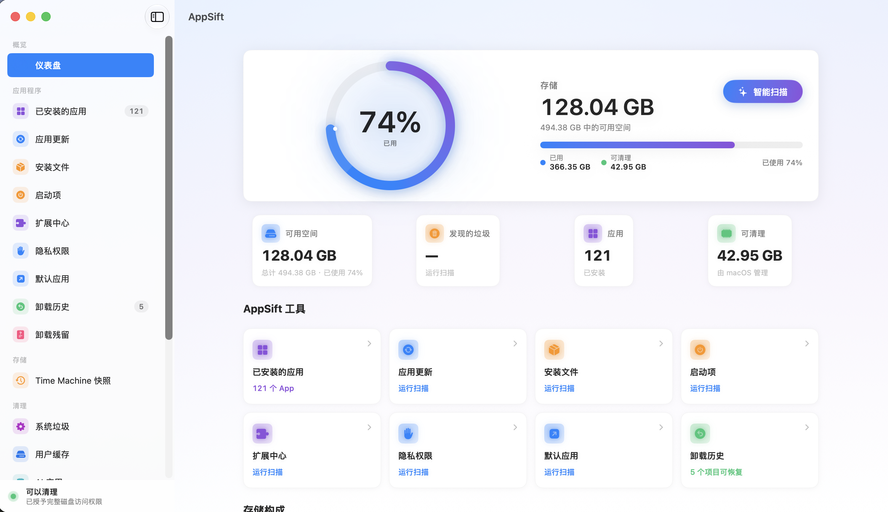
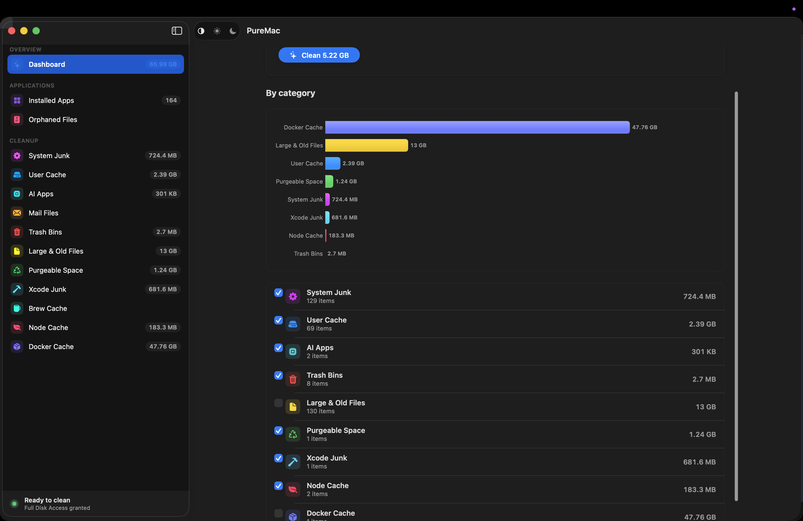
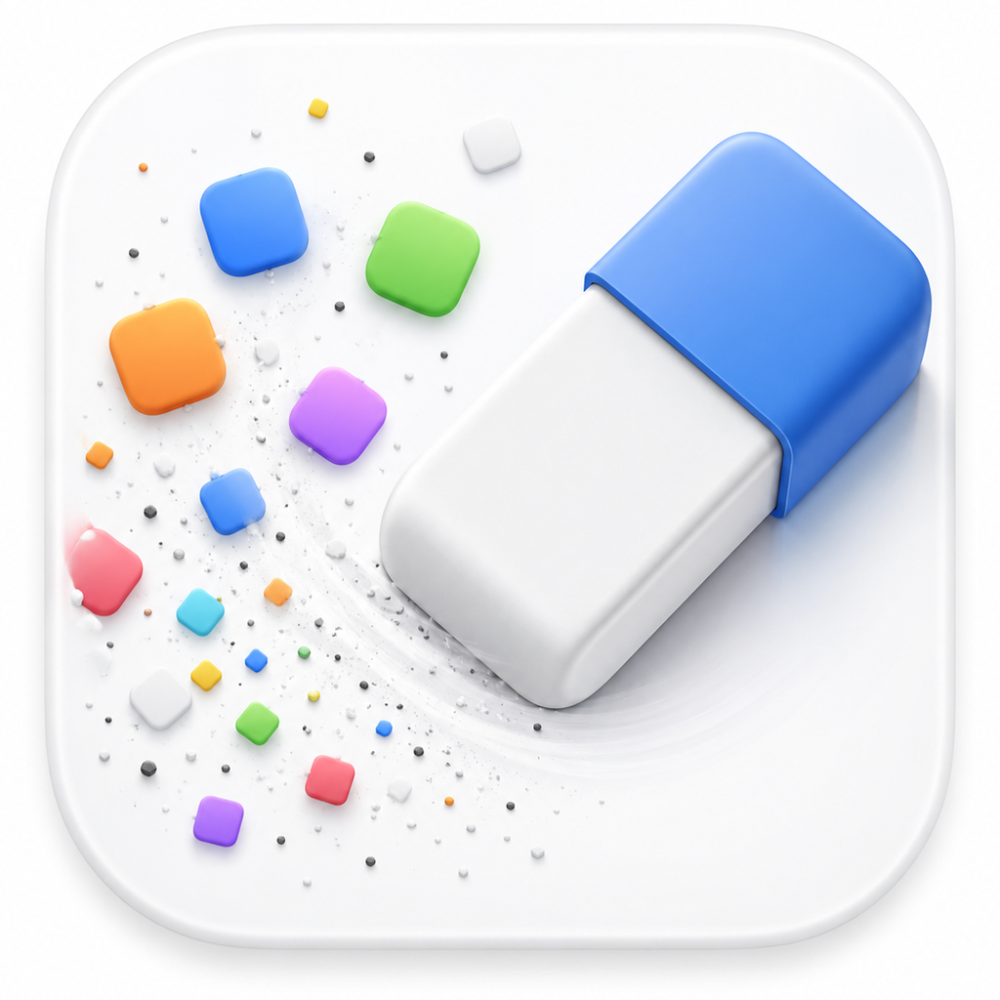

<p align="center">
  
</p>

<p align="center">
  
</p>

## 🌐 [Click Here to Switch to: English Version (英文版)](../README.md)
---

<p align="center">
  
</p>

<h1 align="center">AppSift</h1>

<p align="center">
  <b>夺回被焊死的 Mac 空间。一款零隐私泄露的 Mac 清理与卸载神器，专治存储焦虑。</b>
</p>

<p align="center">
  <a href="https://github.com/GravityPoet/AppSift/releases/latest"></a>
  
  
  
  <a href="../LICENSE"></a>
  <a href="https://github.com/GravityPoet/AppSift/stargazers"></a>
  <a href="https://github.com/GravityPoet/AppSift/releases"></a>
</p>

<p align="center">
  <a href="#-快速开始">快速开始</a> -
  <a href="#-为什么我们需要这个项目">为什么我们需要它</a> -
  <a href="#-痛点对比">痛点对比</a> -
  <a href="#-核心特性">核心特性</a> -
  <a href="#-典型场景">典型场景</a> -
  <a href="#-同类对比">同类对比</a> -
  <a href="#-我们的承诺">我们的承诺</a> -
  <a href="#-功能深度详解">功能深度详解</a> -
  <a href="#-权限说明">权限说明</a>
</p>

---

## ⚡ 快速开始

在 60 秒内上手释放空间：

```bash
# 1. 添加仓库源
brew tap GravityPoet/tap

# 2. 安装 AppSift
brew install --cask appsift
```

或者直接从 [Releases](https://github.com/GravityPoet/AppSift/releases/latest) 下载最新的 `.dmg` 文件并拖入应用程序目录 `/Applications`。

如果你是希望本地审查并自主编译的开发者，请参考 [进阶源码编译指南](#-进阶源码编译指南)。

---

## 🎯 为什么我们需要这个项目？

因为苹果高昂的固态硬盘升级费让很多人只能选择 **256GB 的低配 Mac** (如 Mac mini, MacBook Air / Pro)，而市面上的商业清理软件大多采用**昂贵的订阅制**，默认收集并上传你的隐私数据，还喜欢用*“发现 47 GB 危险垃圾”*这种虚假警报来恐吓你续费。

AppSift 就是为此而生的终结者。它 **100% 免费**、基于 **MIT 协议开源**、完全**本地运行且绝无联网收集隐私**。它不搞虚头巴脑的噱头，只用最干净、最诚实的方式，帮你把被开发缓存和残留垃圾蚕食的硬盘空间一寸一寸夺回来。

---

## ⚖️ 痛点对比

| 没有 AppSift (痛苦现状) ❌ | 拥有 AppSift (爽快体验) 🎉 |
|---|---|
| 每年花 200+ 元订阅清理软件，只为了点一下“一键清理”。 | **100% 免费 (MIT)**。把预算留给真正重要的地方。 |
| 清理软件在后台默默监控你的应用使用习惯和数据，隐私隐患重重。 | **零遥测 (Zero Telemetry)**。完全离线运行，它甚至不需要知道你是谁。 |
| 拖拽到垃圾桶的软件在 `~/Library` 下残留大量冷冻的废弃文件。 | **深度残留扫描 (Orphan Finder)**。匹配 bundle 连根拔起残留。 |
| 各种开发缓存 (Xcode, Docker, Ollama) 动辄吃掉几十 G 空间。 | **开发者专属清理**。一键安全清理大型编译器、容器与本地模型缓存。 |
| 各种红色惊叹号和虚假警告弹窗恐吓你“系统处于危险中”以催促续费。 | **诚实扫描**。只展示真实路径，绝不使用恐吓营销。 |

---

## 🚀 核心特性

- **⚡ 智能卸载与残留清理**
  普通的“拖入垃圾桶”会残留高达 70% 的废弃数据。AppSift 深入系统底层，匹配 bundle ID 和 containers，自动识别并清理所有关联 plist、启动项和日志，而且删除默认移入垃圾桶，支持一键安全还原。

- **⚙️ 开发者特供清理**
  现代开发工具是名副其实的空间杀手。AppSift 专为工程师设计，可安全一键清理 Xcode (`DerivedData`、模拟器缓存)、Node (`npm`/`yarn`/`pnpm` 缓存)、Docker (无用镜像与容器) 以及本地大模型 AI 工具 (Ollama/LM Studio) 的庞大缓存。

- **🛡️ 安全安全，绝对掌控**
  没有任何后台上传或联网分析。所有删除操作默认移动到系统垃圾桶，随时可以后悔。核心系统路径被硬编码锁定保护，绝不会误伤系统。

---

## 👥 典型场景

- 💻 **低配 Mac 钉子户:** 坚守 256GB 固态硬盘，每天都在为几百兆空间腾挪。
- 🛠️ **开发者与 AI 工程师:** 备受 Xcode 缓存、npm 依赖、Docker 镜像和本地大模型缓存折磨的人群。
- 🔒 **隐私洁癖者:** 拒绝给闭源、带隐私收集的商业清理软件授予“完全磁盘访问权限 (Full Disk Access)”的人群。

---

## 📊 同类对比

| | **AppSift** | CleanMyMac | Pearcleaner | Mole | OnyX |
|---|:---:|:---:|:---:|:---:|:---:|
| **价格** | **免费** | $40+/yr / 订阅制 | Free / 免费 | CLI free / GUI paid | Free / 免费 |
| **开源** | **Yes (MIT)** | No / 闭源 | Source-available¹ | CLI only | No / 闭源 |
| **零遥测** | **Yes / 是** | No / 否 | Yes / 是 | Yes / 是 | Yes / 是 |
| **无订阅** | **Yes / 是** | No / 否 | Yes / 是 | — | Yes / 是 |
| **原生界面** | **Yes / 是** | Yes / 是 | Yes / 是 | Terminal-first | Yes / 是 |
| **源码可信度** | **Source + checksums** | Vendor release | Project release | Source | Project release |
| **软件卸载** | **Yes / 是** | Yes / 是 | Yes / 是 | Partial | No / 否 |
| **回收站友好** | **Yes / 是** | Partial | Yes / 是 | Partial | No / 否 |
| **诚实不夸大** | **Yes / 是** | No / 否 | n/a | n/a | n/a |

<sub>¹ Pearcleaner is Apache 2.0 **+ Commons Clause** - source-available but not OSI-approved. AppSift is true MIT.</sub>

---

## 🤝 我们的承诺

清理软件需要 macOS 最深层的权限——**完全磁盘访问权限 (Full Disk Access)**——然后去删除你的文件。这需要极高的信任度。以下是 AppSift 坚守的契约，你可以在源码中验证每一行：

*   **默认可恢复，不可恢复时明确提示**：卸载、重置和清理操作全部采用 Finder 语义的回收机制 (`NSWorkspace.recycle`)，保存映射记录，可随时在回收站还原。还原绝不覆盖已有文件，管理员权限目标会提示通过 Finder 恢复以避免调用高权 Shell。
*   **绝对零遥测**：无分析、无崩溃报告、无“匿名数据收集”。软件完全在本地离线运行。
*   **网络使用完全透明**：只有在你手动点击“检查更新”时，才会发起受限的网络请求。检查包括 App Store 收据、Homebrew Cask 信息以及 Github 官方 Releases 链接，绝不请求未知服务器或后台静默下载安装包。
*   **绝无虚假恐吓**：不搞红色的警报弹窗，不弹虚假的“系统处于危险中”等夸大词汇，只呈现客观数据，由你自行决定。
*   **从不夸大其词**：不吹嘘能“释放可清除空间”、“清理内存”或“加速 Mac”（这些在现代 macOS 上无法被第三方应用可靠实现）。
*   **清理前可完全预览**：没有任何自动删除行为。每一项文件都支持在 Finder 中显示，并内置了针对敏感系统路径的硬编码拦截。
*   **完全可审计**：所有扫描和判断逻辑在 [`AppSift/Services`](../AppSift/Services) 和 [`AppSift/Logic/Scanning`](../AppSift/Logic/Scanning) 中全部开源，接受全球开发者监督。

---

## 🛠️ 进阶源码编译指南

如果你想手动从源码编译 AppSift：

```bash
brew install xcodegen
git clone https://github.com/GravityPoet/AppSift.git
cd AppSift
xcodegen generate
./script/build_and_run.sh
```

开发构建脚本会在您的登录钥匙串中创建一个项目专用的 `AppSift Local Code Signing` 本地自签名身份，以保证您在多次重新编译时隐私权限（如 FDA）保持稳定，私钥绝不会上传仓库。

若要构建 Universal 本地发布版本，备份已有应用并运行：
```bash
./scripts/install-local.sh
```

---

## ⚙️ 功能深度详解

### 应用卸载器
从 `/Applications` 和 `~/Applications` 中检索已安装的应用程序。通过应用名称、Bundle Identifier (Bundle ID)、以及 Container 容器元数据扫描 Library 下的相关依赖。提供 Strict (严格)、Enhanced (增强) 与 Deep (深度) 三种敏感级别，并解释每一项推荐删除的规则依据。AppSift 建立了基于签名的 App Group（应用群组）关联映射关系，只针对具备相同 Team ID 和完全相同签名的 Group 容器进行归属操作。

对于通过 Homebrew Cask、Mac App Store 或 macOS 软件包 (PKG) 安装的应用，AppSift 会在卸载时联动读取对应的 Caskroom 信息、App Store 收据或通过 `pkgutil` 关联的系统包记录，提供一键干净清除。App Uninstaller 与 App Reset (应用重置) 都利用系统 Trash 保证可撤销性，重置动作只会删除 narrow 级别的用户数据，而不会触碰二进制可执行程序或共享组件。

### 应用使用度
通过 Spotlight API 读取本地 `kMDItemLastUsedDate` 元数据，不收集或上传任何应用统计，仅供在本地进行 30/90/180 天“未打开应用”的排序与智能筛选。

### 应用更新检查
完全基于本地数据。直接扫描 Cask 凭证（通过 `brew outdated`）、Sparkle 应用广播 (Sparkle Appcast feeds)、以及 Electron 应用中的 `Contents/Resources/app-update.yml`。只支持 HTTPS 的正规升级协议，过滤当前系统与硬件平台版本，禁止从不明第三方库拉取更新。对于 GitHub 托管的开源项目，仅跳转至官方 release 页面，应用本身绝不在后台下载和执行外部安装包。

### 自动发现安装包
扫描 Finder 缓存和 Spotlight 索引中的 DMG, PKG, MPKG, XIP 或是单 App ZIP。通过 `ditto` 文件指纹分析等方式预览包内信息而不进行提取或挂载。仅限当前用户权限下的常规下载目录清理，禁止自动勾选。

### 启动项与扩展管理
提供 Login Items, 启动代理 (LaunchAgents), 守护进程 (LaunchDaemons) 的全局视图。在用户对 `~/Library/LaunchAgents` 进行状态变更（开启/禁用）时，仅使用固定的 `/bin/launchctl` 路径对具有相同 Label 的常规 plist 文件进行非 root 操作，备份并保存为 `0600` 本地历史供一键撤销。

### TCC 隐私权限审计
读取本机的 TCC (Transparency, Consent, and Control) 隐私配置记录并与 App `Info.plist` 中声明的权限缘由比对。AppSift 使用只读 SQLite 标志安全读取，绝不直接写入 TCC 数据库。用户点击“重置授权”仅触发系统自带 of `/usr/bin/tccutil reset` 指令。

### 系统垃圾清理
Smart Scan 并行机制下，智能归类清理：
*   **System Junk**: 系统临时垃圾与日志。
*   **User Cache**: 动态分析用户缓存目录。
*   **AI Apps**: 清理 Ollama & LM Studio 日志，历史可选。
*   **Xcode Junk**: `DerivedData`、Archives 与模拟器缓存。
*   **Brew / Node / Docker Cache**: 智能卸载 dangling images、pnpm 缓存等。

> **关于 APFS "可清除空间"**：AppSift 会将可清除空间以直观图表展示以供知情，但绝不声称能“一键强制抹除”。因为 APFS 机制规定这部分空间应由 macOS 系统自发回收。我们选择提供诚实的数据，而不是虚假的噱头。

---

## 🛡️ 安全设计
*   **防御 Time-of-Check to Time-of-Use (TOCTOU) 攻击**：在解析符号链接（symlinks）及进行 `unlink` 动作前重新定位并锁定路径。
*   **Hard Allow-list 拦截**：任何位于系统白名单安全根目录之外的路径都会被强制拒载。
*   **免提权原则**：传统 Startup 控制与 app 卸载不请求 admin 管理员特权，仅系统垃圾中的 root 文件使用局部 AppleScript 授权，保持最小权限原则。

---

## 👥 贡献
请参阅 [CONTRIBUTING.md](../CONTRIBUTING.md)。

---

## 许可证 / License
MIT 许可证。详情请参阅 [LICENSE](../LICENSE)。
